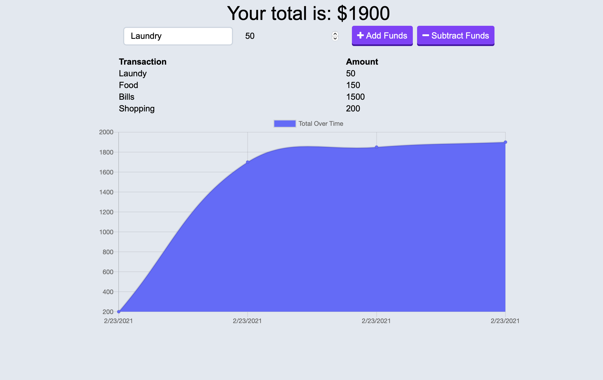

# Budget-Tracker

## Introduction

A Full Stack web application built with express, node and indexDB With which you can keep track of your finances by adding expenses and income.

Deployed on Heroku -

## Features

- Enter deposits offline

- Enter expenses offline

When brought back online:

- Offline entries should be added to tracker.

- Data can be visualized using chart in the front end.

## Business Context

Giving users a fast and easy way to track their money is important, but allowing them to access that information anytime is even more important. Having offline functionality is paramount to our applications success.

## Technologies

- Javascript
- Express
- Node
- IndexDB
- Heroku
